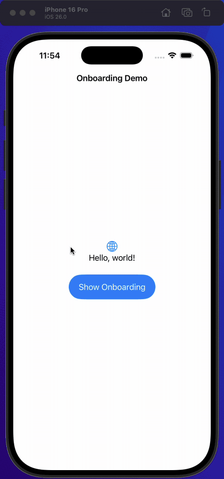

# SwiftUI Onboarding Demo

<p align="center" width="100%">
     
</p>

A SwiftUI demonstration project showcasing modern onboarding flow implementation for iOS 18+ using ScrollView-based navigation. This project demonstrates best practices for creating controlled, programmatic onboarding experiences that leverage the latest SwiftUI APIs.

## 🎯 What This Project Demonstrates

This demo implements a three-step onboarding flow:
1. **Welcome Page** - App introduction and branding  
2. **Location Permission** - Location access request with completion callback  
3. **User Preferences** - Temperature unit selection with data persistence

The implementation uses SwiftUI's horizontal `ScrollView` with programmatic navigation, specifically designed for the controlled progression requirements of onboarding flows.

## 🚀 Why ScrollView Over TabView?

### The TabView Problem

Using `TabView` for onboarding introduces fundamental issues:
- Users can swipe freely between screens, breaking controlled progression  
- Difficult to enforce forward-only navigation or implement skip logic  
- Validation before screen transitions becomes complex  
- No clear completion callbacks for data persistence

### ScrollView Advantages

The ScrollView approach provides complete control over the onboarding experience:

```swift
ScrollView(.horizontal) {
    ForEach(pages) { page in
        // Page content
    }
    .containerRelativeFrame([.horizontal])
    .scrollTargetLayout()
}
.scrollPosition($position)
.scrollTargetBehavior(.viewAligned)
.scrollDisabled(true) // Prevents user swiping
```

**Key Benefits:**
- Button-controlled navigation only  
- Programmatic transitions with validation  
- Conditional flow logic and screen skipping  
- Clean completion callbacks for data handling
- Future-proof with iOS 18+ APIs

## 📱 iOS 18+ Features Used

This implementation leverages modern SwiftUI capabilities:
- **`ScrollPosition`** - Programmatic scroll control and navigation  
- **`containerRelativeFrame([.horizontal])`** - Responsive layouts that adapt to device size  
- **`scrollTargetLayout()`** - Prepares layout for scroll target alignment  
- **`scrollTargetBehavior(.viewAligned)`** - Clean snap-to-view scrolling  
- **`scrollDisabled(true)`** - Prevents user interaction while maintaining programmatic control

These APIs provide the foundation for smooth, controlled onboarding flows that work consistently across devices.

## 🏗 Core Architecture

### OnboardingPage Enum

Defines the flow structure and makes it easy to add or remove steps:

```swift
enum OnboardingPage: String, Identifiable, CaseIterable {
    case welcome
    case location
    case userInput

    var id: String { rawValue }
    static var first: Self = .welcome
}
```

### Programmatic Navigation

Each page handles its own completion logic and triggers the next step:

```swift
func welcomeComplete() {
    scrollToPage(.location)
}

func locationComplete(isAuthorized: Bool) {
    // Optional: Store authorization status
    scrollToPage(.userInput)
}

func userInputComplete(temperatureUnit: UserInputPage.TemperatureUnit) {
    // Save preferences and complete onboarding
    withAnimation {
        isOnboardingVisible = false
    }
}

private func scrollToPage(_ page: OnboardingPage) {
    withAnimation {
        position.scrollTo(id: page.id)
    }
}
```

### Overlay Presentation

The demo uses `.overlay` for onboarding presentation, which provides:
- Main app stays loaded underneath
- Smooth show/hide animations
- Automatic safe area and orientation handling
- Clean dismissal without navigation stack complexity

```swift
struct ContentView: View {
    @State private var isOnboardingVisible = true
    
    var body: some View {
        MainAppView()
            .overlay {
                if isOnboardingVisible {
                    OnboardingView(isOnboardingVisible: $isOnboardingVisible)
                }
            }
    }
}
```

## 🛠 Implementation Details

### Core Container Structure

```swift
struct OnboardingView: View {
    @Binding var isOnboardingVisible: Bool
    private let pages = OnboardingPage.allCases
    @State private var position: ScrollPosition = .init(idType: OnboardingPage.ID.self)

    var body: some View {
        ScrollView(.horizontal) {
            ForEach(pages) { page in
                switch page {
                case .welcome:
                    WelcomePage(onComplete: welcomeComplete)
                case .location:
                    LocationPage(onComplete: locationComplete)
                case .userInput:
                    UserInputPage(onComplete: userInputComplete)
                }
            }
            .containerRelativeFrame([.horizontal])
            .scrollTargetLayout()
        }
        .scrollPosition($position)
        .scrollTargetBehavior(.viewAligned)
        .scrollIndicators(.hidden)
        .scrollDisabled(true)
        .onAppear {
            // Ensure the onboarding starts at the first page.
            // If not set explicitly, position may be undefined.
            position.scrollTo(id: OnboardingPage.first.id)
        }
    }
}
```

### Page Implementation Pattern

Each page follows a consistent pattern with completion callbacks:

```swift
struct WelcomePage: View {
    var onComplete: (() -> Void)?
    
    var body: some View {
        VStack(spacing: 40) {
            // Page content
            
            Button("Get Started") {
                onComplete?()
            }
            .buttonStyle(.borderedProminent)
        }
        .padding()
    }
}
```

## 🎭 Common Onboarding Patterns

This structure easily accommodates various onboarding needs:

### Permission Requests
- **Location**: Maps, weather, location-based services  
- **Notifications**: Push notifications, reminders  
- **Camera/Photos**: Media apps, profile setup  
- **HealthKit**: Fitness and health tracking apps

### User Setup
- **Profile Creation**: Name, avatar, basic information  
- **Preferences**: Display settings, content preferences  
- **Goals**: Fitness goals, learning objectives  
- **Experience Level**: Skill assessment, personalized content

### Business Logic
- **Subscription Offers**: Premium features, pricing tiers  
- **Feature Highlights**: Core functionality demonstration  
- **Terms Acceptance**: Legal requirements, privacy policies

## 🔧 Production Considerations

### State Management

For production apps, consider using a comprehensive data model:

```swift
@Observable class OnboardingManager {
    var hasCompletedOnboarding: Bool {
        UserDefaults.standard.bool(forKey: "hasCompletedOnboarding")
    }
    
    func completeOnboarding(with preferences: UserPreferences) {
        UserDefaults.standard.set(true, forKey: "hasCompletedOnboarding")
        // Save other preferences
    }
}
```

### Data Persistence

Handle onboarding completion by:
- Saving user preferences to UserDefaults or Core Data  
- Storing permission states for app logic  
- Setting completion flags for future app launches  
- Considering onboarding versioning for major updates

### Error Handling

Implement proper error handling for:
- Permission request failures
- Network-dependent setup steps
- User input validation
- Graceful fallbacks for skipped steps

## 🔄 Extending the Flow

Adding new onboarding steps:

1. Add case to `OnboardingPage` enum
2. Create new page view with completion callback
3. Add switch case in `OnboardingView`
4. Implement completion handler logic

The modular structure makes it straightforward to customize for any app's onboarding requirements while maintaining clean, maintainable SwiftUI code.

## 🏗 Built With

iOS 18.0+  
Xcode 26 Beta 2  
Swift 6.2

This approach provides a production-ready foundation for sophisticated onboarding flows that take full advantage of modern SwiftUI capabilities.
